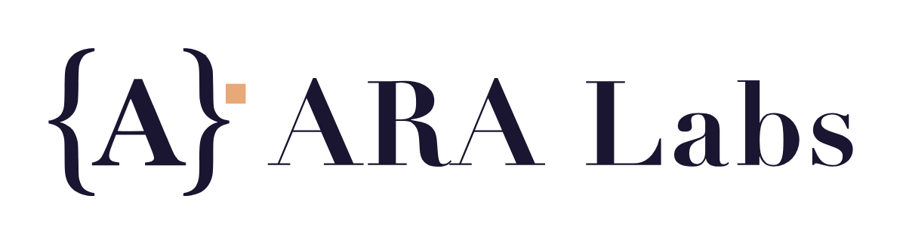

# ARA Labs Brand Kit

Official logos and brand assets for **ARA Labs**. If you are writing
about ARA Labs, linking to us, or presenting work built on our tools,
grab what you need here — no permission required.

  <picture>
    <source media="(prefers-color-scheme: dark)" srcset="logo/png/ara-labs-lockup-horizontal-white-1200.png">
    
  </picture>

## Assets

Every asset ships as SVG (vector, preferred) plus pre-rendered
transparent PNGs.

| Asset | Use it for | SVG | PNG sizes |
|---|---|---|---|
| **Mark** `{A}` | avatars, favicons, app icons, small spaces | [`ara-labs-mark.svg`](logo/svg/ara-labs-mark.svg) | 1024 / 512 / 256 / 128 / 64 / 32 |
| **Mark, white** | the same, on dark backgrounds | [`ara-labs-mark-white.svg`](logo/svg/ara-labs-mark-white.svg) | 1024 / 512 |
| **Horizontal lockup** | headers, slides, articles | [`ara-labs-lockup-horizontal.svg`](logo/svg/ara-labs-lockup-horizontal.svg) | 2400 / 1200 / 600 |
| **Horizontal lockup, white** | the same, on dark backgrounds | [`ara-labs-lockup-horizontal-white.svg`](logo/svg/ara-labs-lockup-horizontal-white.svg) | 2400 / 1200 |

PNGs live in [`logo/png/`](logo/png/), named `<asset>-<width>.png`.

## Colors

| Color | Hex | Role |
|---|---|---|
| Deep ink | `#1a1530` | primary mark and wordmark color |
| Warm peach | `#e8a878` | the accent square in the mark |
| White | `#ffffff` | mark and wordmark on dark backgrounds |

## Usage

Please do:

- Use the ink version on light backgrounds and the white version on
  dark backgrounds.
- Keep clear space around the logo of at least the height of the peach
  square.
- Scale proportionally from the SVG when you need a size we don't ship.

Please don't:

- Recolor, stretch, rotate, outline, or add effects to the logo.
- Rebuild the wordmark in another font or rearrange the lockup.
- Use the logo in a way that implies ARA Labs endorses your product.

## License

The name "ARA Labs" and these logos identify ARA Labs (ARA Commons,
Inc.). You may reproduce them unmodified to refer to ARA Labs — in
articles, talks, integrations, and "built with" credits. They are not
covered by an open-source license and may not be used as or in your own
branding.

Questions or a use case not covered here: open an issue.
